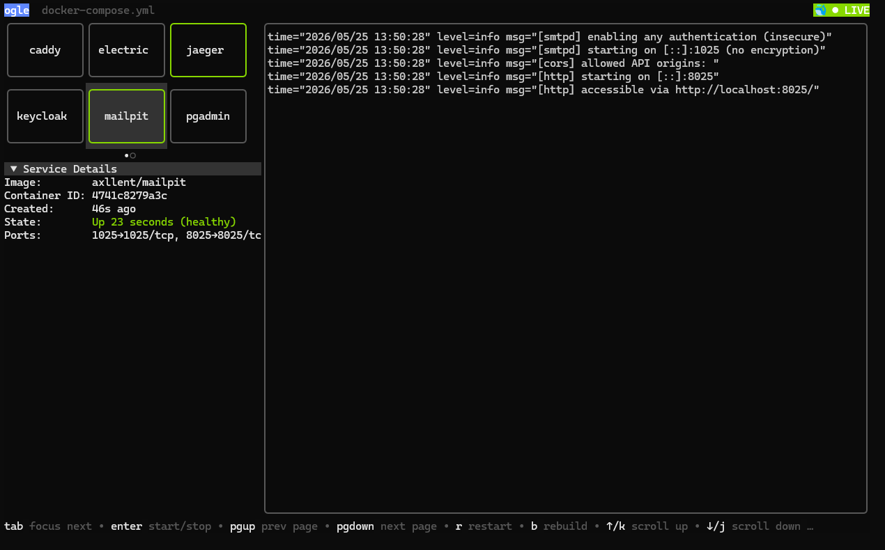

# ogle

[](https://pkg.go.dev/github.com/ma-tf/ogle)
[](https://goreportcard.com/report/github.com/ma-tf/ogle)

[](https://github.com/ma-tf/ogle/actions)
[](https://github.com/ma-tf/ogle/releases/latest)
[](https://github.com/ma-tf/ogle/blob/master/COPYING)

```txt
       , ·. ,.-·~·.,   ‘              ,.-·^*ª'` ·,                 ,.  '                      _,.,  °    
      /  ·'´,.-·-.,   `,'‚           .·´ ,·'´:¯'`·,  '\‘            /   ';\               ,.·'´  ,. ,  `;\ '  
     /  .'´\:::::::'\   '\ °       ,´  ,'\:::::::::\,.·\'         ,'   ,'::'\            .´   ;´:::::\`'´ \'\  
  ,·'  ,'::::\:;:-·-:';  ';\‚      /   /:::\;·'´¯'`·;\:::\°      ,'    ;:::';'          /   ,'::\::::::\:::\:' 
 ;.   ';:::;´       ,'  ,':'\‚    ;   ;:::;'          '\;:·´      ';   ,':::;'          ;   ;:;:-·'~^ª*';\'´   
  ';   ;::;       ,'´ .'´\::';‚  ';   ;::/      ,·´¯';  °        ;  ,':::;' '          ;  ,.-·:*'´¨'`*´\::\ '  
  ';   ':;:   ,.·´,.·´::::\;'°  ';   '·;'   ,.·´,    ;'\         ,'  ,'::;'            ;   ;\::::::::::::'\;'   
   \·,   `*´,.·'´::::::;·´     \'·.    `'´,.·:´';   ;::\'       ;  ';_:,.-·´';\‘     ;  ;'_\_:;:: -·^*';\   
    \\:¯::\:::::::;:·´         '\::\¯::::::::';   ;::'; ‘     ',   _,.-·'´:\:\‘    ';    ,  ,. -·:*'´:\:'\° 
     `\:::::\;::·'´  °            `·:\:::;:·´';.·´\::;'         \¨:::::::::::\';     \`*´ ¯\:::::::::::\;' '
         ¯                           ¯      \::::\;'‚          '\;::_;:-·'´‘         \:::::\;::-·^*'´     
          ‘                                    '\:·´'              '¨                    `*´¯              
```

*ogle* is a terminal UI for observing and operating Docker Compose projects — no setup required.



## Requirements

- Go 1.26+ (to build from source)
- Docker daemon (for log streaming and service actions)
- A Docker Compose file (auto-discovered or specified with `-f`)

## Installation

```sh
go install github.com/ma-tf/ogle@latest
```

Or download a pre-built binary from the [releases page](https://github.com/ma-tf/ogle/releases).

## Quick Start

```sh
# Auto-discover compose.yaml in current directory
ogle

# Specify a compose file explicitly
ogle -f docker-compose.yml
```

From there:

- Press `?` to toggle between compact and full help
- Press `F1` (or click the brand text) to open the About overlay
- Press `,` or `esc` to open/close the Settings overlay (theme selection, log buffer cap adjustment — auto-saves)
- Use arrow keys / tab to navigate, `ctrl+c` to quit
